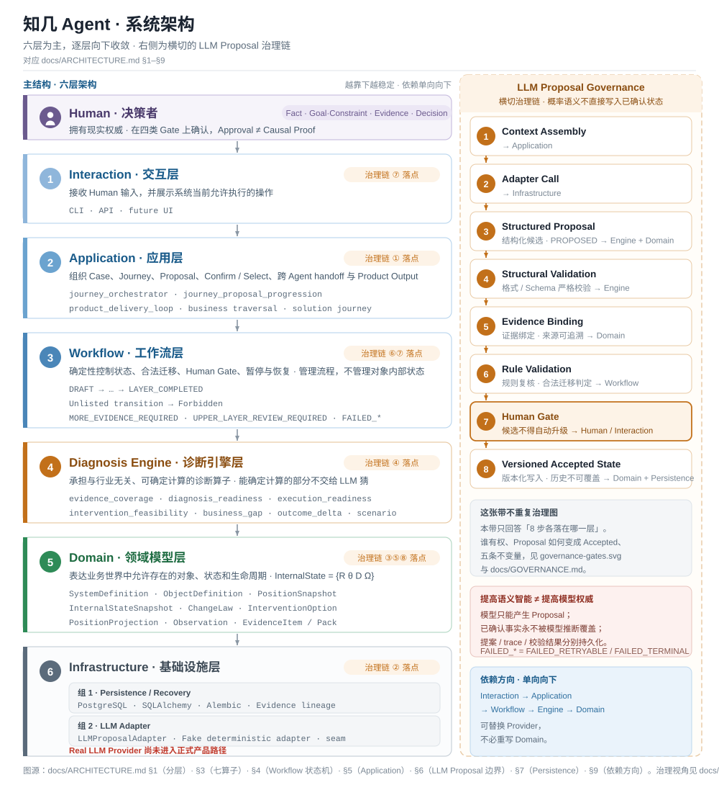

# ARCHITECTURE · 知几的软件架构

[English](ARCHITECTURE.md) | [中文](ARCHITECTURE.zh-CN.md)

> 本文档回答一个核心问题：<br>
> **METHOD 中定义的分析方法，以及 GOVERNANCE 中定义的人机权限边界，如何被实现成一个可运行、可恢复、可追溯的软件系统。**

知几的架构不是从“如何调用一个 LLM”开始设计的。

它首先接受两个上游约束：

```text
METHOD
定义业务世界如何被表达和推演
        ↓
GOVERNANCE
定义谁能提出、确认和改变什么
        ↓
ARCHITECTURE
把这些约束变成软件边界和运行规则
```

因此，架构的核心目标不是让 Agent 自由地完成更多事情，而是同时满足两件事：

> **让概率性的语义能力可以进入系统；<br>
> 又让业务状态、权限和流程不依赖模型本身保持正确。**

这形成知几最重要的软件设计原则：

> **概率性的语义判断交给 Agent，确定性的状态、计算和流程交给软件系统。**

---

## 1. Architecture at a Glance · 整体结构



> 这张图展示 METHOD 与 GOVERNANCE 如何落到软件分层：语义能力通过受控边界进入，Workflow / Engine / Domain 保持确定性治理，Persistence 与 Evidence / Lineage / Recovery 支撑可恢复和可审计运行。

知几可以概括为下面几层：

```text
Interaction Surface
CLI / API / future UI
        ↓
Application Services
        ↓
Deterministic Workflow
        ↓
Diagnosis Engine
        ↓
Domain Model
        ↓
Persistence

      ↘ Semantic Proposal Boundary
      ↘ Evidence / Lineage
      ↘ Recovery / Audit
```

这些层并不是按技术组件随意拆分，而是分别承担不同责任。

| Layer | 核心责任 |
|---|---|
| **Interaction** | 接收 Human 输入并展示系统当前允许执行的操作 |
| **Application** | 组织 Case、Journey、Proposal、Confirm / Select、跨 Agent handoff 和 Product Output |
| **Workflow** | 确定性控制当前状态、合法迁移、Human Gate、暂停与恢复 |
| **Engine** | 承担与具体行业无关、可确定计算的诊断算子 |
| **Domain** | 表达业务世界中允许存在的对象、状态和生命周期 |
| **Persistence** | 保存 Domain、Journey、Decision、Evidence lineage 和恢复信息 |
| **Semantic Proposal Boundary** | 允许 Agent / LLM 产生非权威语义 Proposal，但不能绕过治理边界 |

这套结构背后的关键分离是：

```text
Semantic Intelligence
负责“理解、生成、推演”

Deterministic System
负责“约束、记录、状态迁移、恢复”
```

两者需要协作，但不能合并成一个“万能 Agent”。

---

## 2. Domain Model · 把 METHOD 变成可持久化的业务对象

METHOD 中使用的是概念语言：

```text
System
→ Object
→ Position
→ InternalState
→ ChangeLaw
→ Intervention
→ New Position
```

Architecture 的第一项工作，是把这些概念变成明确、可验证、可引用的软件对象。

当前核心 Domain 类型包括：

```text
SystemDefinition
SystemBoundary
SystemRule

ObjectDefinition

PositionSnapshot
InternalStateSnapshot

ChangeLaw
InterventionOption
PositionProjection

Observation

SourceDocument
EvidenceItem
EvidencePack
```

这些对象不是为了“把一切结构化”，而是为了让系统能够明确区分：

> **现在保存的到底是一项事实、一个当前状态、一个因果假设、一种干预方案，还是一个未来预测。**

### 2.1 Actual State 与 Forecast 必须分离

一个最重要的例子是 Position。

架构中刻意区分：

```text
PositionSnapshot
实际状态的版本化表达

PositionProjection
实施前的预测

Observation / Measurement
实施后的原始观测

ActualOutcome
基于 Measurement 的审核结果
```

因此不能出现：

```text
PositionProjection
      ↓
自动变成
ActualOutcome
```

也不能因为 Human 选择了某个方案，就把预测结果提前写成已经发生的现实结果。

这使 GOVERNANCE 中的：

```text
Projection ≠ Actual Outcome
```

在软件对象层真正成立。

### 2.2 Domain 只描述业务语义

Domain 的职责是定义：

- 什么对象可以存在；
- 对象之间允许有什么关系；
- 每类对象具有哪些本地不变量；
- 生命周期和 epistemic status 如何表达。

例如可以理解为：

```text
System CONTAINS Object

Object HAS PositionSnapshot
Object HAS InternalStateSnapshot

ChangeLaw DESCRIBES change mechanism

Intervention ACTS_ON selected variables / mechanism

Intervention PRODUCES PositionProjection

Observation SUPPORTS later assessment
```

Domain **不负责**：

- 数据库读写；
- API；
- CLI；
- 页面；
- 模型调用；
- Prompt；
- Workflow 编排。

因此，底层 Domain 不需要知道上层最终使用什么模型、什么数据库或什么交互方式。

这也是后续各层能够独立演进的基础。

---

## 3. Diagnosis Engine · 能确定计算的部分不交给 LLM 猜

METHOD 中有一些任务需要语义判断，例如：

- 企业当前可能处于什么 Position；
- 一个 ChangeLaw 是否可能成立；
- 哪些 Intervention 值得提出。

但也有另一类任务，一旦输入确定，就应该得到稳定、可重复的结果。

这些能力不应该依赖模型“再判断一次”。

当前 `packages/engine/` 中的实际确定性算子包括：

```text
evidence_coverage
diagnosis_readiness
execution_readiness
intervention_feasibility
business_gap
outcome_delta
scenario
```

它们分别承担诸如：

- Evidence 覆盖、缺口与冲突；
- 诊断信息是否达到继续分析条件；
- 执行准备度与来源链；
- Intervention 是否满足约束；
- 当前 Position 与 benchmark 之间的差距；
- 结果指标如何计算 delta；
- Scenario benchmark 与 hard constraint 判断。

Engine 的核心原则是：

> **如果一个判断可以由明确输入和规则确定计算，就不把它留给 LLM 自由发挥。**

因此：

```text
Agent
负责开放语义空间中的推断

Engine
负责确定性规则空间中的计算
```

这也解释了为什么三个 Agent 不需要各自维护一套独立“业务算法”。

Agent 是任务角色，Engine 是共享计算能力。

---

## 4. Workflow · 把 GOVERNANCE 变成确定性状态迁移

如果系统只有 Domain + Agent，复杂 Journey 仍然容易退化成：

```text
Human
  ↕
Agent
  ↕
Long Conversation
```

然后依赖模型自己记住：

- 当前分析到了哪里；
- 什么已经确认；
- 什么还只是 Proposal；
- 下一步是否允许继续。

因此，知几使用显式 Workflow State Machine 管理过程状态。

### 4.1 Workflow 管理的是 Process State

Workflow 负责：

- 当前处于哪个 Layer；
- 当前处于哪个 State；
- 哪些 Proposal 已经存在；
- 哪些结果已经 Confirmed；
- 下一步允许哪些 Action；
- 哪些迁移需要 Human Gate；
- 是否需要更多 Evidence；
- 是否需要返回上层 Review；
- 当前失败是否允许 Retry；
- 当前 Layer 是否已经完成。

它管理的是：

```text
Process State
```

而不是：

```text
Object.InternalState
```

这个区别非常重要。

例如：

```text
CHANGE_LAWS_PROPOSED
```

是流程状态；

而：

```text
ChangeLaw
```

是 Domain record。

Workflow 可以控制：

> 当前是否允许确认 ChangeLaw。

但不能把自己的 Workflow State 当成业务事实本身。

### 4.2 正常链与异常链都必须显式

典型正常路径包括：

```text
DRAFT
→ MATERIALS_COLLECTED
→ SYSTEM_PROPOSED
→ SYSTEM_CONFIRMED
→ OBJECT_PROPOSED
→ OBJECT_CONFIRMED
→ CURRENT_POSITION_PROPOSED
→ CURRENT_POSITION_CONFIRMED
→ TARGET_POSITION_PROPOSED
→ TARGET_POSITION_CONFIRMED
→ CHANGE_LAWS_PROPOSED
→ CHANGE_LAWS_CONFIRMED
→ INTERVENTIONS_PROPOSED
→ INTERVENTION_SELECTED
→ RESULT_GENERATED
→ LAYER_COMPLETED
```

但架构真正重要的不只是 Happy Path。

还必须显式表达：

```text
MORE_EVIDENCE_REQUIRED
UPPER_LAYER_REVIEW_REQUIRED
FAILED_RETRYABLE
FAILED_TERMINAL
```

以及：

- rejection；
- resume；
- retry；
- hard-constraint failure。

因为复杂决策系统中：

> **“暂时不能继续”本身就是一个合法状态。**

### 4.3 Fail Closed

Workflow 的关键规则是：

```text
Unlisted transition
        ↓
     Forbidden
```

即：

> **没有被明确允许的状态迁移，一律拒绝。**

这使治理边界不依赖 Prompt 提醒。

即使 Agent 产生了一个结构正确、语言合理的 Proposal，如果当前 Workflow State 不允许进入对应下一步，系统仍然不会迁移。

因此：

> **治理不是“告诉模型不要越权”，而是让越权不存在合法系统路径。**

### 4.4 Human Gate 是 Workflow 约束，不是 Agent 自觉

现有 Workflow Contract 对 mandatory human approval 有显式 actor 限制。

需要人工权限的 Gate 只能由：

```text
ActorType.USER
```

完成。

同时：

```text
Approval
≠ Workflow Transition Audit
≠ Epistemic Status
```

Human Approval 可以允许流程继续，但不会因此自动改变 ChangeLaw 的 epistemic status。

这把 GOVERNANCE 中的：

```text
Human Approval ≠ Causal Proof
```

落实成了软件规则。

---

## 5. Application Services · 把各层组织成真正的 Product Loop

Domain、Engine 和 Workflow 各自解决局部问题。

Application 层负责把它们组合成用户真正经历的连续行为。

可以概括为：

```text
Case Intake
    ↓
Start / Resume Journey
    ↓
Obtain Semantic Input / Proposal
    ↓
Validate
    ↓
Confirm / Reject / Select
    ↓
Progress Workflow
    ↓
Complete Layer
    ↓
Handoff to Next Layer / Agent
    ↓
Complete Case Design
    ↓
Generate Product Output
```

当前 Application 层已经包含实际的：

```text
journey_orchestrator
journey_proposal_progression
product_delivery_loop
business traversal / handoff
scenario portfolio
scenario → solution handoff
solution journey
```

这些服务的意义不是增加一层“胶水代码”，而是防止上层入口直接修改底层状态。

也就是说：

```text
CLI / API
   ↓
Application Service
   ↓
Workflow + Domain Contract
```

而不是：

```text
CLI / LLM
   ↓
直接写数据库
```

---

## 6. Semantic Proposal Boundary · LLM 如何进入系统

知几不会把 LLM 放在系统控制中心。

模型进入架构的身份是：

> **Semantic Proposal Provider**

它负责产生开放语义空间中的候选判断，但这些判断仍受既有 Authority Contract 约束。

当前语义 Proposal family 包括：

```text
SYSTEM
OBJECT
CURRENT_POSITION
TARGET_POSITION
CHANGE_LAWS
INTERVENTIONS
PROJECTION
SCENARIO_CANDIDATES
SOLUTION_CANDIDATES
```

但不同 family 并不拥有相同 authority。

现有语义模型已经区分：

```text
USER_FACT
CONFIRMED
INHERITED
HYPOTHESIS
```

例如：

- `PositionSemantics` 可以表达 evidence-grounded hypothesis；
- `ChangeLawSemantics` 可以表达 causal hypothesis；
- `InterventionSemantics` 可以表达 proposed intervention；
- `ProjectionSemantics` 是 non-authoritative forecast；
- `ObjectIdentitySemantics` 不允许由 provider 自行创造；
- `InternalStateSemantics` 中的 R / θ / D / Ω 保持 explicit USER-owned。

因此真实模型接入不需要重写治理体系。

它应该进入现有链：

```text
Authorized Context + Evidence
          ↓
   Semantic Provider
          ↓
 Proposal / Hypothesis
          ↓
 Schema / lineage validation
          ↓
 Workflow + Human Gate
          ↓
Accepted Domain State
```

核心原则是：

> **提高 Semantic Intelligence，不等于提高模型 Authority。**

### 6.1 当前真实状态：Real Provider 与受治理 Semantic Generation 已实现

当前 Architecture 需要把几个不同事实分开，而不能统一称为“LLM 已接入”。

第一，早期 proposal / review seam 仍然存在：

```text
LLMProposalInput
→ proposal adapter
→ raw proposal
→ strict validation
→ typed candidate
→ PROPOSED Domain record
→ Workflow proposal command
→ safe trace metadata
```

这个 proposal-only `LLMProposalAdapter` 路径在默认 production composition 中仍保持 fake-only。

第二，独立的 OpenAI-compatible real completion path 已通过 `LLMCompletionAdapter` 与真实 Provider Adapter 实现；`SemanticGenerationService` 可以通过这条边界生成五类 evidence-grounded Semantic Proposal：

```text
CURRENT_POSITION
TARGET_POSITION
CHANGE_LAWS
INTERVENTIONS
PROJECTION
```

真实运行路径是：

```text
Confirmed Context / Evidence
        ↓
Real LLM Provider
        ↓
Untrusted Raw Semantic Output
        ↓
Strict Parsing / Identifier Validation
        ↓
HYPOTHESIS / AGENT Proposal
        ↓
USER Gate
```

五类 Proposal 均已经通过真实 OpenAI-compatible Provider 做过端到端验证。普通 CI 刻意不发起 live provider call；provider verification 仍为 opt-in，也不等于 production readiness。

两个 Authority Boundary 仍未改变：

- `R / θ / D / Ω` 保持 USER-owned，Agent 不能生成或静默覆盖；
- Scenario / Solution Candidate 的 Agent semantic authorship 仍因当前 Authority Contract 保持 USER-owned 而 deferred。

Current Position 还存在一个交互限制：系统可以 staging Agent 起草的 Position，但当前确认路径尚不能把这个 draft 与 USER 提供的 InternalState 合并为一次确认，因此公开 Demo 的 Current Position 仍由 USER 完整输入。

所以，当前 Architecture 已经不仅证明“模型应该如何进入系统”，而是已经存在真实的受治理模型路径；但这仍不等于自主企业诊断，也不等于真实语义质量已经被企业案例验证。

### 6.2 Runtime Context 与 Persisted Trace 分离

真实 LLM 需要看到足够的业务语义，才能完成有效诊断。

但长期持久化的 Trace 又不应该保存所有敏感业务原文。

因此架构需要区分：

```text
Ephemeral Authorized Runtime Context
        ↓
Remote / Local Model
        ↓
Raw Proposal
        ↓
Validation
        ↓
Safe Digest / Structured Result / Metadata
        ↓
Persisted Trace
```

现有 trace 设计有意保留：

- record / evidence ID；
- lifecycle / source metadata；
- hash；
- length；
- safe summary；

而不是把原始业务全文直接写入长期 trace。

因此：

> **模型运行时上下文与系统长期审计记录不是同一个数据面。**

这为后续真实企业数据的隐私、安全和可审计性保留了边界。

---

## 7. Persistence & Recovery · Conversation 不是系统状态

业务诊断 Journey 可能持续很长时间，并跨越：

- 多个 Agent；
- 多个 Layer；
- 多次 Human Gate；
- 多个会话；
- 程序重启。

因此，知几不能把模型上下文当作系统记忆。

核心状态需要独立持久化，包括：

```text
Domain records
Journey / Workflow state
Human decisions
Evidence lineage
Case / Journey binding
Selections
Completion records
Recovery information
```

当前 Product Loop 已经存在基于：

```text
PostgreSQL
SQLAlchemy
Alembic migrations
```

的持久化路径，并支持 restart / recovery。

所以：

> **Conversation Context 不是系统状态本身。**

即使：

- 对话窗口丢失；
- 模型更换；
- 程序退出；
- 运行进程重启；

已经确认的 Domain State 和 Journey progress 仍然可以从持久化事实恢复。

### 7.1 Recovery 依赖事实，而不是重新推断历史

恢复时，系统应该依赖：

```text
persisted Journey state
Domain records
decision / transition audit
lineage
current authoritative head
```

而不是要求 LLM 根据一段摘要重新猜：

> “之前大概进行到哪里。”

这也是为什么：

> **Narrative Summary 不能成为重建 Domain State 的权威来源。**

---

## 8. Evidence & Lineage · 为什么最终结果可以追溯

知几不仅需要保存：

> 最终选了哪个方案。

还需要能够回答：

```text
这个状态从哪里来？
哪个 Proposal 产生了它？
基于什么 Evidence？
谁确认的？
经过了什么 Workflow State？
后来是否被 superseded？
```

因此系统保留显式 lineage，把：

```text
Evidence
   ↓
Proposal
   ↓
Review / Confirmation
   ↓
Accepted State
   ↓
Selection
   ↓
Derived Product Output
```

连接起来。

跨 Layer 时，StatePackage 同样依赖明确来源引用，而不是复制一份失去来源的自然语言摘要。

这使 METHOD 中的递归继承，与 GOVERNANCE 中的 Authority Separation，都能在软件中保留可追溯性。

---

## 9. Dependency Direction · 为什么底层不能知道上层

知几保持明确的依赖方向：

```text
domain
  ↑
engine
  ↑
workflows
  ↑
application
  ↑
API / CLI / UI
```

越靠下的层：

> **越稳定，也越不应该知道上层的实现方式。**

例如 Domain 不应该知道：

- 用户通过 CLI 还是 Web 使用系统；
- 使用哪个 LLM；
- 数据库是 PostgreSQL 还是其他实现；
- API 使用什么 Framework；
- Product UI 如何展示某个状态。

这种单向依赖带来两个结果。

第一：

> 可以替换模型 Provider，而不需要重写 Domain。

第二：

> 可以调整交互方式，而不需要修改核心业务语义和 Workflow Authority。

因此，变化较快的 AI / UI 能力不会反向污染最稳定的业务模型。

---

## 10. Runtime Separation · 一次运行中哪些东西必须分开

整个架构最终保护的是几个运行时对象之间的分离：

```text
Domain State
系统当前允许依赖的业务状态

Semantic Proposal
Agent / LLM 产生的非权威候选

Human Decision
确认、选择、批准等现实权威事件

Position Projection
实施前预测

Measurement / Actual Outcome
实施后现实结果
```

它们不能相互自动替代。

因此，一个典型运行过程是：

```text
Persisted Domain State + Evidence
             ↓
Authorized Runtime Context
             ↓
Semantic Proposal
             ↓
Validation
             ↓
Human Decision
             ↓
Workflow Transition
             ↓
New Accepted Domain State
             ↓
Position Projection
             ↓
[future real implementation]
             ↓
Observation / Measurement
             ↓
Actual Outcome
```

这是 METHOD、GOVERNANCE 和 ARCHITECTURE 三篇文档真正汇合的地方。

---

## 11. Architecture Boundary · 架构当前不声称什么

Architecture 描述的是：

> **现有设计如何把业务语义、AI Proposal、Human Authority、Workflow 和 Persistence 组织成一套受治理的软件系统。**

它不意味着以下事项已经成立：

```text
Real LLM semantic quality is validated             ✗

Real enterprise diagnosis is validated             ✗

Cross-industry generalization is validated         ✗

Production deployment is complete                  ✗

Autonomous external execution is authorized        ✗
```

同样：

> 一项 capability 在代码中存在，也不自动等于 Production-ready。

具体实现状态由：

```text
docs/STATUS.md
```

负责说明。

真实运行过程由：

```text
demo/README.md
```

负责展示。

工程事实由：

```text
evidence/
```

负责提供。

---

## 12. Summary · 架构的核心

知几的软件架构可以压缩成一句话：

> **Domain 保存业务语义，Engine 负责确定性计算，Workflow 控制合法状态迁移，Application 组织完整 Journey，Semantic Provider 提供非权威智能，Human 提供现实权威，Persistence 与 Lineage 保证状态不依赖会话并可被恢复和追溯。**

进一步压缩：

```text
LLM proposes
Human authorizes
Workflow enforces
Engine calculates
Domain represents
Persistence remembers
Evidence explains
```

这些职责不能被一个“更强的 Agent”简单合并。

架构的目标也不是限制 AI，而是：

> **让 AI 可以在一个边界清晰的系统里持续变强，而不需要随着模型能力增长不断重写业务事实、权限和状态治理。**

---

## 13. 本文与其他文档的关系

本文只回答“METHOD 与 GOVERNANCE 如何被实现成软件系统”。它不重新展开完整业务分析方法，也不把当前实现状态和工程验证混进架构定义。

| 读者还想确认 | 去哪 |
|---|---|
| System / Object / Position / ChangeLaw / Intervention 和五层递归到底怎么工作？ | `docs/METHOD.md` |
| Agent、Human、Workflow 各自有什么权限？Proposal 如何变成 Accepted State？ | `docs/GOVERNANCE.md` |
| 当前哪些架构能力已经 implemented，哪些仍是 fake-only / deferred？ | `docs/STATUS.md` |
| 一次 Product Loop 实际怎么经过这些层？ | `demo/README.md` |
| Persistence / recovery / Workflow / E2E 真的跑通过吗？ | `evidence/` |
| Semantic Authority、Human Gate、Epistemic State 等架构假设去哪挑战？ | `rfcs/RFC-001-ARCHITECTURE-REVIEW.md` |

整体关系是：

```text
METHOD
定义“业务问题怎么分析”
        ↓
GOVERNANCE
定义“谁能决定什么”
        ↓
ARCHITECTURE
定义“软件如何保证”
        ↓
STATUS / DEMO / EVIDENCE
证明“当前真实做到哪里”
```
