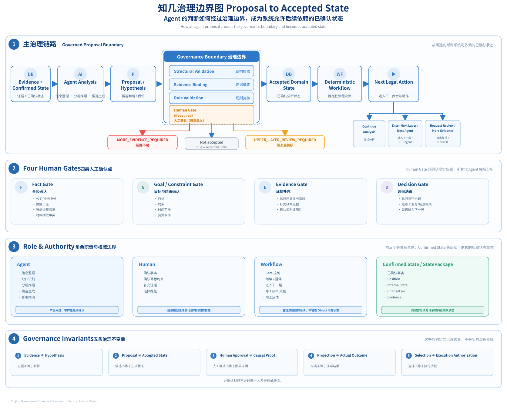

# GOVERNANCE · Human–AI Governance 与决策权限

> 本文档回答一个核心问题：<br>
> **当 Agent 本身是概率性系统时，知几如何让它参与复杂企业决策，又不让模型生成的内容直接变成业务事实、系统状态或现实执行权限。**

知几不试图通过“让模型更聪明”来消除不确定性。

它选择另一条路径：

> **把不同类型的信息、判断和决策放在不同的权限层级中，并让状态迁移、人工确认和证据来源都显式存在。**

因此，知几治理的重点不是：

> “AI 能不能做判断？”

而是：

> **“AI 可以提出什么？谁有权确认什么？确认之后系统可以做什么？什么仍然必须等待现实验证？”**

整套治理可以概括为：

```text
Evidence / Confirmed State
          ↓
    Agent Reasoning
          ↓
 Proposal / Hypothesis
          ↓
      Human Gate
          ↓
 Accepted Domain State
          ↓
Deterministic Workflow
          ↓
 Next Analysis Step
          ↓
 Projection / Decision
          ↓
     Measurement
          ↓
   Actual Outcome
```

## Governance at a Glance · 治理总览



> Human Gate 只负责需要现实权威的确认；Agent 负责产生候选判断，Workflow 负责合法状态迁移，Accepted Domain State 才是后续流程允许依赖的系统权威状态。

---

## 1. Why Governance · 为什么需要治理

复杂企业决策和普通问答最大的区别，不只是问题更难，而是：

> **前一步判断会成为后一步的输入。**

如果一条分析链持续经过：

```text
Business Diagnosis
        ↓
Scenario Diagnosis
        ↓
Solution Design
        ↓
Projection
        ↓
Decision
```

那么任何一个未经区分的错误，都可能沿着后续步骤被持续放大。

典型风险包括：

- 事实与推断混在一起；
- Agent 对缺失信息进行补全，却被后续步骤当成事实使用；
- Human 接受某个判断后，被误解成“这个判断已经被证明”；
- Projection 被当成 Actual Outcome；
- 方案被选择后，被误解成系统拥有现实执行权限；
- 跨层分析时，下层判断无意覆盖上层已经确认的条件；
- 对话中断后，只能依赖模型“记得之前说过什么”。

因此，知几首先把三个问题拆开：

```text
谁负责产生判断？
谁有权确认判断？
谁负责让流程合法地继续？
```

对应三个基本责任主体：

```text
Agent
Human
Workflow
```

同时，已经进入系统的正式业务状态由 Domain 承载。

---

## 2. Four Different Things · 四类不能混在一起的东西

治理的第一步，不是增加审批，而是先区分语义。

在知几中，至少需要把下面四类东西分开：

### 2.1 Evidence · 证据

Evidence 描述：

> **我们目前拥有什么来源支持的信息。**

它可以来自：

- 用户输入；
- 企业材料；
- 数据；
-外部资料；
- 已有业务记录；
- Measurement。

Evidence 本身不自动等于某个业务结论。

它只是为后续判断提供来源基础。

---

### 2.2 Hypothesis / Proposal · 假设与候选判断

Agent 可以基于 Evidence 和已确认状态形成：

- Position Hypothesis；
- ChangeLaw Hypothesis；
- Intervention Proposal；
- Candidate Scenario；
- Solution Option；
- Position Projection。

这些内容首先属于：

```text
Machine Proposal
```

而不是：

```text
Accepted Business State
```

因此：

> **模型“生成了什么”与系统“认可什么”是两件事。**

---

### 2.3 Accepted Domain State · 已接受的系统状态

当某个 Proposal 经过合法验证和必要的 Human Gate 后，它可以成为后续分析允许依赖的状态。

这里的“Accepted”含义是：

> **系统允许把它作为当前 Journey 的正式分析基础继续使用。**

它并不意味着：

> “这个判断已经成为现实世界中不可质疑的真理。”

因此，Public 文档中常说的 `Domain Truth`，更准确地理解为：

> **Authoritative Domain State——当前系统中的权威业务状态。**

它是系统权威，不等于终极事实。

---

### 2.4 Actual Outcome · 实际结果

现实效果不能由 Proposal 或 Human Approval 直接产生。

例如：

```text
Intervention
      ↓
Position Projection
```

只能表达：

> 如果假设成立，可能发生什么。

真正的：

```text
Actual Outcome
```

必须来自后续 Observation / Measurement，并经过相应评估。

因此：

```text
Projection ≠ Actual Outcome
```

是知几最重要的长期治理边界之一。

---

## 3. Authority Separation · 谁能决定什么

知几把权限分成三个不同来源：

```text
Agent
→ Proposal / Hypothesis / Analysis

Human
→ Fact / Constraint / Selection / Decision

Workflow
→ Legal State Transition / Gate Enforcement / Audit
```

已经接受的业务状态由 Domain 保存：

```text
Authoritative Domain State
```

四者之间互相作用，但不能相互替代。

---

### 3.1 Agent · 负责产生候选认知

Agent 的职责是推进认知，而不是直接成为事实来源。

它适合承担：

- 信息整理；
- Evidence 组织；
- 缺口识别；
- Position 分析；
- ChangeLaw 假设；
- Candidate generation；
- Intervention proposal；
- Projection reasoning；
- explanation。

Agent 的典型输出是：

```text
Proposal / Hypothesis
```

Agent **不能因为自己生成了一个结论，就自动完成以下动作**：

- 把 Proposal 升级为 Accepted State；
- 修改已经确认的历史状态；
- 改变 Human 已确认的目标或硬约束；
- 把 ChangeLaw 提升为已证明因果规律；
- 把 Projection 写成 Actual Outcome；
- 把 Solution Selection 解释为现实执行授权。

核心原则：

> **Agent 可以扩展候选空间，但不能单方面扩大自己的权威。**

---

### 3.2 Human · 负责现实权威

Human 负责 Agent 无法自行获得，或者没有权限自行决定的内容。

主要包括：

- 现实事实；
- 目标与优先级；
- 约束和风险边界；
- 对 Evidence 的补充与确认；
- 关键分析路径选择；
- Candidate / Intervention / Solution 的选择；
- 是否进入下一层或下一阶段。

Human 的作用不是逐字审核 Agent 的所有输出。

更准确地说：

> **Human 在需要现实权威的节点承担责任。**

但是 Human 权威同样有边界。

Human 可以说：

> “这个 ChangeLaw 可以作为当前决策假设继续使用。”

但这不等于：

> “这个 ChangeLaw 已被现实世界证明为真实因果规律。”

因此：

```text
Human Approval ≠ Causal Proof
```

---

### 3.3 Workflow · 负责确定性治理

Workflow 不负责业务推理。

它负责：

- 当前处于哪个 Layer；
- 当前处于哪个 Workflow State；
- 下一步允许执行什么 Action；
- 哪些 Proposal 已经产生；
- 哪些结果已经确认；
- 是否需要 Human Gate；
- 是否需要更多 Evidence；
- 是否需要回到上层重新确认；
- 是否允许进入下一阶段；
- 失败后可以如何恢复。

Workflow 管理的是：

```text
Process State
```

而不是：

```text
Business InternalState
```

两者必须分离。

Workflow 不能因为“觉得某个业务判断合理”就替 Human 确认，也不能静默修改 Domain Record。

它的职责是：

> **保证一个已经定义好的治理规则被确定性执行。**

---

## 4. Human Gates · 人在什么地方必须介入

知几不把 Human Gate 理解为“每一步都让人点确认”。

Human Gate 的目的，是在**现实权威不能交给 Agent 的地方**阻止分析链自动继续。

当前方法上将 Human Gate 归纳为四类。

---

### 4.1 Fact Gate · 事实确认

回答：

> **这件事在现实中是真的吗？**

例如：

- 企业 / 业务身份；
- 当前经营状态；
- 数据口径；
- 材料中提取的关键事实；
- 某项 Evidence 是否适用于当前 Case；
- 当前 Position 描述是否符合现实。

Agent 可以整理和提取事实候选，但不能仅凭生成结果把它们升级为已确认事实。

---

### 4.2 Goal / Constraint Gate · 目标与约束确认

回答：

> **我们到底要优化什么，以及哪些边界不能突破？**

包括：

- 经营目标；
- 阶段优先级；
- 时间范围；
- 预算；
- 能力条件；
- 风险边界；
- 合规要求；
- 业务规则。

这些信息会直接影响：

```text
R / θ / D / Ω
```

如果 Agent 可以自行改变这些条件，它实际上已经从“分析者”变成了“决策者”。

因此这类状态必须保持 Human Authority。

---

### 4.3 Evidence Gate · 证据补充

回答：

> **当前证据够不够继续？**

当关键判断缺乏必要 Evidence 时，知几不是要求 Agent继续“猜完整”，而是允许流程停下来：

```text
Evidence Gap
     ↓
MORE_EVIDENCE_REQUIRED
     ↓
Request Evidence
     ↓
Human Provides / Confirms
     ↓
Resume
```

这里一个重要原则是：

> **信息不足是一种合法状态，而不是必须被模型补全的异常。**

---

### 4.4 Decision Gate · 路径决策

回答：

> **在多个可行方向中，当前到底选择哪条路？**

例如：

- 是否继续当前诊断；
- 哪个业务方向值得深入；
- 哪个 Candidate Scenario 被选择；
- 哪个 Intervention 值得进入下一阶段；
- 哪个 Solution Option 被接受；
- 是否进入下一分析层级。

这些选择产生：

```text
Human Decision
```

但仍然不会自动产生：

```text
Execution Authorization
```

---

## 5. Proposal → Accepted State · 一个 Agent 判断如何进入正式状态

知几最关键的治理链不是：

```text
Prompt
  ↓
Answer
```

而是：

```text
Evidence / Confirmed State
          ↓
Authorized Context
          ↓
Agent Analysis
          ↓
Proposal / Hypothesis
          ↓
Structural Validation
          ↓
Human Gate（如需要）
          ↓
Accepted Domain State
          ↓
Deterministic Workflow
          ↓
Next Analysis Step
```

这里每一步解决不同问题。

**Agent Analysis**

回答：

> 可能是什么？

**Validation**

回答：

> 这个输出是否满足结构、来源和当前状态要求？

**Human Gate**

回答：

> 这个判断是否具有继续进入系统所需的现实权威？

**Accepted Domain State**

回答：

> 后续分析现在允许依赖什么？

**Workflow**

回答：

> 接下来合法地能做什么？

这使“生成内容”和“系统状态”之间始终存在明确边界。

---

## 6. Five Core Boundaries · 五个核心边界

知几的人机治理可以压缩成五个 `≠`。

### 6.1 Evidence ≠ Hypothesis

Evidence 描述已有信息。

Hypothesis 是对这些信息的解释。

即使一个 Hypothesis 由大量 Evidence 支持，它仍然需要保留自己的判断属性，而不能假装自己就是 Evidence。

---

### 6.2 Proposal ≠ Accepted State

Agent 可以提出：

- 当前 Position；
- Target Position；
- ChangeLaw；
- Intervention；
- Scenario；
- Solution；
- Projection。

但只有经过合法流程，Proposal 才能成为后续分析允许依赖的正式状态。

因此：

> **模型输出不能通过“被生成”这一事实获得权威。**

---

### 6.3 Human Approval ≠ Causal Proof

Human Approval 代表：

> “当前可以把这个判断作为决策或分析基础继续使用。”

它不代表：

> “这个机制已经被现实世界证明。”

尤其对 ChangeLaw 而言，审批不应静默改变它的 Epistemic Status。

因果可信度仍然需要 Evidence、Measurement 和后续验证积累。

---

### 6.4 Projection ≠ Actual Outcome

Position Projection 描述：

> **如果当前假设和干预成立，预期会发生什么。**

Actual Outcome 描述：

> **现实中最终发生了什么。**

两者之间必须存在：

```text
Implementation
     ↓
Observation
     ↓
Measurement
     ↓
Outcome Assessment
```

因此，系统不能因为方案被批准，就提前制造“效果已经发生”的状态。

---

### 6.5 Selection ≠ Execution Authorization

选择某个：

- Scenario；
- Intervention；
- Solution Option；

只说明：

> **这个分析路径或设计方向被接受。**

它不代表系统可以自动：

- 修改生产系统；
- 调用企业外部执行接口；
- 花费预算；
- 改变业务规则；
- 对真实用户采取行动。

现实执行需要另一套明确授权机制。

当前知几刻意保留：

```text
No execution
No authorization
```

作为产品边界。

---

## 7. Deterministic Enforcement · 治理不能只靠提示词

如果上面的边界只写在 System Prompt 中，它仍然不是可靠治理。

因此，知几把关键治理规则放进确定性 Workflow。

现有 Workflow Contract 的关键原则包括：

```text
Unknown transition → fail closed
```

即：

> **没有明确允许的状态迁移，一律不允许发生。**

同时：

- mandatory human gate 只接受 `USER` actor；
- 每次合法迁移产生新的版本；
- transition 保留 actor / time / reason / lineage；
- Domain record 由引用进入 Workflow，不由 Workflow 静默修改；
- Approval、Workflow State 和 Epistemic Status 相互分离；
- terminal state 不允许出现未定义的后续迁移。

因此，治理不是：

> “提醒模型不要越权。”

而是：

> **即使模型试图越权，系统也没有合法状态迁移允许它这么做。**

---

## 8. Pause, Review and Recovery · 不确定时允许停下来

复杂分析中，并不是所有情况都应该继续向前。

知几显式允许几类停止状态。

### More Evidence Required

当当前证据不足时：

```text
Proposed State
      ↓
MORE_EVIDENCE_REQUIRED
      ↓
Evidence Resolution
      ↓
Recorded Resume State
```

系统保留“原本应该回到哪里”，补齐 Evidence 后再继续。

---

### Upper-layer Review Required

如果下层分析发现：

> 当前继承的上层条件可能已经不再成立，

它不能直接修改上层状态。

而是进入：

```text
UPPER_LAYER_REVIEW_REQUIRED
```

把冲突返回上层重新判断。

这与 METHOD 中的原则一致：

> **向上传递的是 Candidate Impact / Conflict，不是状态覆盖。**

---

### Failure

失败被进一步区分为：

```text
FAILED_RETRYABLE
FAILED_TERMINAL
```

也就是说：

> “这一次执行失败”与“这个 Journey 已经终止”不是同一个状态。

这种显式失败语义也是治理的一部分，因为它避免 Agent 在错误之后自行编造一个“看起来完成”的结果。

---

## 9. Cross-layer Governance · 跨层继承也需要权限边界

知几使用：

```text
Layer(n).Object = Layer(n+1).System
```

进行递归分析。

但递归不能意味着：

> 下一层获得了重写上一层历史的权限。

因此，StatePackage 中需要区分两类内容。

### 可继续参与下层推演

```text
R / θ / D / Ω
```

下一层可以在更细粒度信息下识别相关变量，并重新计算可行空间。

### 作为继承基线

```text
Position
ChangeLaw
Evidence
```

这些内容具有明确来源。

下一层可以：

- 引用；
- 补充 Evidence；
- 形成新的 Hypothesis；
- 发现冲突。

但不能：

> **静默覆盖上一层已经确认的记录。**

如果下层发现继承条件需要改变，正确路径是：

```text
Lower-layer Conflict
        ↓
Upper-layer Review
        ↓
Human / Workflow Re-evaluation
        ↓
New Confirmed State
```

而不是直接写回。

因此：

> **递归分析允许认知继续深化，但不允许权限随着层级下钻而无限扩张。**

---

## 10. Auditability · 为什么每个关键判断都要有来源

治理不只要求“当前状态正确”，还需要能够回答：

> **它为什么变成现在这样？**

因此，关键状态需要保留：

- source / evidence references；
- proposal identity；
- actor；
- decision；
- time；
- version；
- parent lineage；
- correlation / causation metadata；
- selection / confirmation record。

这使系统可以区分：

```text
谁提出的
谁确认的
基于什么 Evidence
在哪个状态下确认
后来发生过什么变化
```

而不是最终只剩一段无法追溯来源的报告。

其中一个重要原则是：

> **Narrative Summary 不是 Domain State 的重建来源。**

也就是说，系统不能依赖一段自然语言总结重新“猜回”之前的正式状态。

---

## 11. Governance Does Not Mean Certainty · 治理不等于消除不确定性

知几的人机治理并不承诺：

> 只要经过 Human Gate，判断就一定正确。

它真正提供的是：

```text
不确定性有类型
        ↓
判断有来源
        ↓
权限有边界
        ↓
状态变化有记录
        ↓
错误可以暂停、返回和修正
        ↓
预测与真实结果可以被区分
```

因此治理的目标不是：

> **让 AI 永远不犯错。**

而是：

> **让错误不会因为权限混乱、状态混淆和长链传递而悄悄变成系统事实。**

---

## 12. Current Boundary · 当前实现与治理边界

当前项目已经实现了确定性 Workflow、Human Gate、Evidence / lineage、持久化与恢复等治理骨架。

但真实外部 LLM Provider 仍处于接入阶段，当前正式运行路径中的 Semantic Proposal 能力仍存在 fake/demo seam。

因此，现阶段可以证明的是：

> **治理结构能够运行。**

还不能据此证明：

> **真实模型进入以后已经能够稳定地产生高质量企业诊断。**

同样，当前系统不具备自主现实执行权限。

这两类问题分别属于：

- `docs/STATUS.md`：当前到底实现到哪里；
- `demo/README.md`：实际一次推演如何运行；
- `evidence/`：有哪些工程事实支持这些主张。

---

## 13. Summary · 治理的核心

知几的人机治理可以压缩成一句话：

> **让 Agent 负责提出候选，让 Human 负责现实权威，让 Workflow 负责确定性约束，让 Domain 保存已经被合法接受的状态，再由 Measurement 区分“我们曾经认为会发生什么”和“现实最终发生了什么”。**

进一步压缩：

```text
Agent can propose.
Human can authorize.
Workflow can enforce.
Domain can remember.
Evidence can support.
Measurement can verify.
```

但任何一个角色都不能替代其他角色。

这就是知几治理设计的核心。

---

## 14. 本文与其他文档的关系

本文只回答“谁能决定什么，以及一个 Agent 判断如何合法进入系统状态”。它刻意不重复业务分析方法、软件实现细节和工程验证结果。

| 读者还想确认 | 去哪 |
|---|---|
| 知几到底如何从企业问题一路分析到 Scenario / Solution？ | `docs/METHOD.md` |
| Human Gate、Workflow、Domain、LLM Adapter 在软件里如何实现？ | `docs/ARCHITECTURE.md` |
| 当前哪些治理能力已经 implemented，哪些仍是 fake-only / deferred？ | `docs/STATUS.md` |
| 一次真实 Product Loop 中，人和 Agent 分别在哪些位置出现？ | `demo/README.md` |
| Workflow / Human Gate / recovery 真的跑通了吗？ | `evidence/` |
| Semantic Authority、Human Gate by State or Risk 等开放问题去哪讨论？ | `rfcs/RFC-001-ARCHITECTURE-REVIEW.md` |

整体阅读关系是：

```text
METHOD
回答“怎么分析”
        ↓
GOVERNANCE
回答“谁能决定什么”
        ↓
ARCHITECTURE
回答“软件如何保证”
        ↓
STATUS / DEMO / EVIDENCE
回答“现在真实做到哪、跑起来怎样、证据是什么”
```
