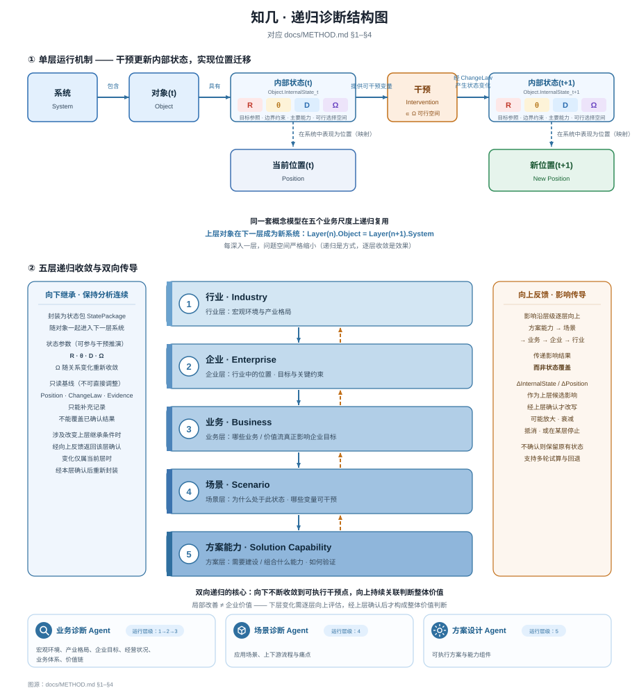

# METHOD · Zhiji Diagnosis and Solution-Simulation Method

[English](METHOD.md) | [中文](METHOD.zh-CN.md)

> This document answers one core question:<br>
> **How does Zhiji turn a broad, complex enterprise AI-transformation problem into a business decision problem that can be intervened on, compared, and validated?**

Zhiji does not begin with an AI capability and search for a use case. It starts from the enterprise's real business problem and first asks:

1. **What is the object being analyzed, and what environment is it in?**
2. **Why is it in its current position?**
3. **Which variables actually influence the outcome?**
4. **Which variables can be changed by real interventions?**
5. **Given current goals, constraints, and capabilities, which interventions are actually feasible?**
6. **Can a local change create value at a higher business-system level?**

The method has four parts:

```text
Core Model
how business problems are expressed in one language
        ↓
Recursive Diagnosis
how complex problems progressively narrow
        ↓
State Inheritance & Impact Propagation
how reasoning continues across layers
        ↓
Three Agents
how stable cognitive tasks are assigned to stable roles
```

## Method at a Glance



> The same Core Model is recursively reused across Industry → Enterprise → Business → Scenario → Solution Capability. Confirmed `StatePackage` flows downward; Candidate Impact flows upward instead of directly overwriting higher-layer state.

---

## 1. Core Model · How to Represent a Business Problem

Zhiji starts from a basic proposition:

> **A business problem can be understood as: why an Object is in its current Position within a System, and how to move it toward a target Position under real constraints.**

To let Industry, Enterprise, Business, Scenario, and Solution Capability use the same analytical language, Zhiji abstracts analysis as:

```text
System
  ↓
Object
  ↓
Position
  ↓
ChangeLaw
  ↓
Intervention
  ↓
New Position
```

This is not a static taxonomy. It is a continuous reasoning chain:

> **First define the observation boundary, then identify the carrier of change; first determine the current Position, then explain the change mechanism; only then discuss intervention.**

### 1.1 System

**System** is the environment in which the Object exists.

For the current analysis, it defines the Object's:

- boundaries;
- rules;
- resource conditions;
- external constraints;
- relationships with other objects.

The same Object placed in different Systems may have completely different value, constraints, and action space.

Before analysis begins, the first question is therefore:

> **Within which system are we observing this object?**

The purpose of System is not to enumerate every environmental factor. It is to define **which external conditions form the valid boundary of the current judgment**.

---

### 1.2 Object

**Object** is the entity that actually carries change in the current analysis.

At different layers, an Industry, Enterprise, Business, Scenario, or Solution Capability can all become the current Object.

Defining the Object narrows a complex system for the first time into one precise question:

> **What, exactly, is changing?**

If the Object is unclear, Position, ChangeLaw, and Intervention easily become mixed across layers, producing errors such as:

- treating an enterprise-level problem as a scenario-level problem;
- mistaking local efficiency improvement for enterprise-value improvement;
- building technical capabilities disconnected from higher-level business goals.

The Object is therefore the carrier of all later reasoning about change.

---

### 1.3 Position

**Position** describes the Object's relative state within the current System.

Zhiji does not reduce business state to one metric. It simultaneously considers:

- **Structural Position**: where the Object sits in the system structure;
- **Functional Position**: what function it performs;
- **Performance Position**: how it currently performs;
- **Evolutionary Position**: what direction it is moving toward.

A business problem is therefore no longer merely:

> “A metric went down.”

It becomes:

> **What Position is the Object currently in? Why is it there? What gap exists between the current and target Position?**

Position reconnects fragmented metrics to the business system.

A metric can describe one result. Position attempts to describe:

> **what that result means within the whole system.**

---

### 1.4 Internal State

Knowing Position is still insufficient to explain:

> Why is the Object here, and what can actually be changed in reality?

Zhiji therefore abstracts Object internal state as:

```text
Object.InternalState = {R, θ, D, Ω}
```

where:

**R — Objectives / References**

Goals and evaluation references.

It answers:

> What state counts as better? Which goal is the current judgment serving?

R may come from operating goals, business goals, stage-specific priorities, or other confirmed evaluation references.

**θ — Constraints**

Boundaries and constraints.

It answers:

> What cannot be done, or cannot be done in a certain way?

Examples include budget, time, risk, compliance, business rules, and other hard boundaries.

**D — Capabilities**

Current capabilities and resource conditions.

It answers:

> What capabilities actually exist now, and what is missing?

D includes not only technical capability but also data, organization, process, resources, and other conditions that affect execution.

**Ω — Feasible Option Space**

The set of actions that are actually feasible now.

It is not the set of every theoretically possible solution. It is:

> **the action space that can genuinely be considered under the current System, goals, constraints, and capabilities.**

It can be represented as:

```text
Ω = Φ(System, R, θ, D)
```

A theoretically “effective” solution that exceeds current capability, budget, compliance requirements, or other real boundaries is therefore outside the currently executable Intervention space.

Zhiji does not conflate “possibly effective” with “currently doable.”

---

### 1.5 ChangeLaw

**ChangeLaw** explains:

> **Which variable changes, through what mechanism, can change the Object's Position?**

It is concerned not merely with correlation but with a structured change chain:

```text
Driver
   ↓
Mechanism
   ↓
Intermediate Variables
   ↓
Result
```

It also considers:

- **Threshold**: under what conditions does the change occur?
- **Time Lag**: how long before the effect becomes observable?
- **Feedback**: does the outcome create reinforcing or balancing feedback?
- **Expected Transition**: which Position transition is expected?

ChangeLaw moves analysis from:

> “There is a problem here.”

to:

> **“Which variable, through which mechanism, creates the current outcome?”**

Only at this level does a later Intervention have a clear target.

At the same time, a ChangeLaw in Zhiji begins as a **judgment that requires Evidence and later validation**. It does not become business fact merely because an Agent generated it.

---

### 1.6 Intervention

**Intervention** is an active action applied to changeable variables.

An Intervention must satisfy at least two conditions:

1. it acts on an identified ChangeLaw or key variable;
2. it lies within the current feasible option space Ω.

Zhiji therefore does not follow:

```text
What can AI do?
      ↓
Find somewhere to use it
```

It follows:

```text
What mechanism produces the business result?
        ↓
Which variables can actually be changed?
        ↓
Which Intervention is feasible in reality?
        ↓
Is AI an appropriate capability for implementing that Intervention?
```

AI is a **possible capability mechanism**, not the analytical starting point.

---

### 1.7 New Position

The objective of an Intervention is not merely to “finish a project” or “launch an AI feature.” It is to change the Object's real business state.

This can be abstracted in two steps.

**State Update**

```text
InternalState(t+1)
    = F(
        InternalState(t),
        Intervention(t),
        System(t)
      )
```

where the change is constrained by ChangeLaw.

Then:

**Position Migration**

```text
Position(t+1)
    = H(
        InternalState(t+1),
        System(t+1)
      )
```

Zhiji therefore does not ultimately ask:

> Was the AI feature launched?

It asks:

> **Did the Intervention actually change the Object's InternalState and move it toward the target Position?**

The complete basic chain is:

```text
Define System
    ↓
Select Object
    ↓
Determine Current Position
    ↓
Define Target Position
    ↓
Explain ChangeLaw
    ↓
Identify changeable variables
    ↓
Find Intervention within Ω
    ↓
Simulate New Position
    ↓
Validate later through Measurement
```

---

## 2. Recursive Diagnosis · Why Recursion Is Necessary

A real enterprise is not a single-layer system.

An AI-transformation problem usually crosses:

- external industry environment;
- enterprise-level operations;
- a concrete business or value stream;
- a specific operational scenario;
- the capability that must eventually be built or combined.

If analysis stays too high-level:

> it becomes macro-level judgment and cannot produce an executable Intervention.

If it moves local too early:

> it may optimize one scenario without knowing whether that scenario serves an important enterprise goal.

Zhiji therefore organizes analysis into five continuous observation layers:

```text
Industry
   ↓
Enterprise
   ↓
Business
   ↓
Scenario
   ↓
Solution Capability
```

These are not five independent methods.

Each layer reuses the same Core Model:

```text
System
→ Object
→ Position
→ InternalState
→ ChangeLaw
→ Intervention
```

Only the currently observed System and Object change.

---

### 2.1 Object → Next-layer System

The key recursive relationship is:

> **The Object that requires deeper analysis at the current layer becomes the new System when its internal structure is opened at the next layer.**

Formally:

```text
Layer(n).Object = Layer(n+1).System
```

For example:

```text
External Business Environment
          ↓
       Industry
          ↓
      Enterprise
          ↓
 Business / Value Stream
          ↓
       Scenario
          ↓
 Solution Capability
```

At a higher layer, an Enterprise can be an Object inside an Industry System.

When analysis needs to enter that Enterprise, it is no longer only the observed Object; it becomes the next System, within which a more specific Business / Value Stream is selected as the next Object.

Recursion is therefore not merely “breaking the problem into more levels.”

Its core purpose is:

> **At each deeper layer, redefine the System boundary and transform the confirmed higher-layer direction into a more concrete lower-layer problem.**

Thus:

> **Recursion is the method; progressive narrowing is the result.**

---

### 2.2 What Each of the Five Layers Answers

The five layers are not meant to create a complex taxonomy. They prevent problems at different scales from being mixed together.

| Layer | Main question |
|---|---|
| **Industry** | How are the external environment and industry structure changing? |
| **Enterprise** | Where is the enterprise positioned in the current industry environment, and what are its goals and key constraints? |
| **Business** | Which businesses / value streams actually affect enterprise goals and deserve deeper analysis? |
| **Scenario** | Why is a specific scenario in its current state, and which variables are worth intervening on? |
| **Solution Capability** | If intervention is chosen, what capabilities must be combined or built, and how should success be validated? |

A broad problem then narrows as:

```text
Enterprise AI transformation
      ↓
Business directions worth attention
      ↓
Key business / value stream
      ↓
Specific scenario worth intervening on
      ↓
Executable capability solution
```

---

## 3. State Inheritance · How Information Continues Downward

Entering the next layer does not mean:

```text
Switch Agent
    ↓
Start analysis again
```

Confirmed higher-layer results must become the starting point of lower-layer analysis.

Zhiji organizes cross-layer information as a:

```text
StatePackage
```

A StatePackage contains two classes of information.

### 3.1 State Parameters That Continue Participating in Reasoning

```text
R / θ / D / Ω
```

That is:

- objectives;
- constraints;
- capabilities;
- current feasible option space.

At the next layer, finer-grained information can identify adjustable variables within these states and recompute the real feasible option space.

### 3.2 Information Inherited as Analysis Baseline

```text
Position
ChangeLaw
Evidence
```

These represent higher-layer:

- state judgment;
- change mechanism;
- evidence basis.

A lower layer may supplement and refine them, but cannot overwrite confirmed historical state without basis.

The cross-layer process is therefore closer to:

```text
Confirmed StatePackage(n)
          ↓
      Object(n)
          ↓
    System(n+1)
          ↓
 Continue Diagnosis
```

than:

```text
New Layer
   ↓
Start Again
```

This prevents higher-layer goals, constraints, and knowledge from disappearing automatically when the analysis layer or Agent changes.

---

## 4. Impact Propagation · How Local Change Feeds Upward

Recursion must not only narrow downward. It must also ask upward:

> **Did the local Intervention actually create broader business value?**

Impact may be reassessed along:

```text
Solution Capability
        ↑
     Scenario
        ↑
     Business
        ↑
    Enterprise
        ↑
     Industry
```

But the most important rule is:

> **What propagates upward is candidate impact, not state overwrite.**

A local change must not directly rewrite confirmed higher-layer state simply because the model believes it has an effect.

A more accurate path is:

```text
Intervention(n+1)
       ↓
ΔInternalState(n+1)
ΔPosition(n+1)
       ↓
evaluate propagation
       ↓
Candidate Impact(n)
       ↓
review / confirm
       ↓
new higher-layer state (if accepted)
```

As local impact propagates upward, it may:

- be amplified;
- be attenuated;
- be offset by other mechanisms;
- stop at a certain layer.

Each layer must therefore ask again:

> **Is this change sufficient to alter the parent Object's InternalState or Position?**

If yes, the new state is confirmed before forming a new StatePackage. If not, the previous higher-layer state remains and propagation stops.

This creates a bidirectional recursive structure:

```text
Higher layer
defines direction / goals / constraints
          ↓
     StatePackage
          ↓
Lower layer
opens structure / locates variables / designs intervention
          ↓
    Intervention
          ↓
local state and position change
          ↑
 Candidate Impact
          ↑
higher layer reassesses total impact
```

Zhiji therefore tries to preserve two things at once:

> **Narrow downward until the real executable intervention point is found;<br>
> remain connected upward to judge whether local change creates whole-system business value.**

---

## 5. Three Agents · Why Three Agents Instead of Five

The five analysis layers describe:

> **the business scale to which a problem must be analyzed.**

The Agent split describes:

> **which stable cognitive task is owned by which role.**

These are different dimensions.

Zhiji therefore does not mechanically create one Agent per layer. It converges on three continuous roles:

```text
Business Diagnosis Agent
          ↓
Scenario Diagnosis Agent
          ↓
Solution Design Agent
```

### 5.1 Business Diagnosis Agent

Covers:

```text
Industry → Enterprise → Business
```

The shared task of this stage is:

> **Start from enterprise-level operation, progressively narrow the problem space, and find the directions truly worth deeper analysis.**

It focuses on:

- macro environment and industry structure;
- enterprise objectives and current operating state;
- enterprise Position and direction of change;
- which Business / Value Streams matter most to the objectives;
- which business problems deserve deeper diagnosis;
- which Scenarios should enter the next stage.

Its core responsibility is:

> **Take the whole-system view, locate sufficiently, and narrow progressively.**

Typical output chain:

```text
Industry Position
      ↓
Enterprise Position
      ↓
Business Position
      ↓
Investment Directions
      ↓
Candidate Scenario Portfolio
```

---

### 5.2 Scenario Diagnosis Agent

Operates at:

```text
Scenario
```

It inherits confirmed goals, constraints, business direction, Position, Evidence, and relevant ChangeLaws from Business Diagnosis.

At this stage the question is no longer mainly “where is the problem?” but:

> **Why is this scenario in its current state, is it actually worth solving, and which variables can be realistically intervened on?**

It analyzes:

- Current Position;
- Target Position;
- key business variables;
- ChangeLaw;
- intervenable variables;
- Intervention;
- Expected Position Change;
- whether current goals, constraints, and capabilities allow that change.

Its core responsibility is:

> **Causal localization and value validation.**

A broad Candidate Scenario should eventually narrow into a more explicit decision object:

```text
Current Position
      ↓
Target Position
      ↓
ChangeLaw
      ↓
Intervention
      ↓
Expected Position Change
```

---

### 5.3 Solution Design Agent

Operates at:

```text
Solution Capability
```

It does not search for the business problem again. It inherits the confirmed Scenario, Target Position, ChangeLaw, Intervention direction, Evidence, objectives, and constraints.

Its primary question is:

> **If we decide to change this scenario, what capability combination is required, and how should we validate whether the solution works?**

It is responsible for:

- mapping intervention variables to capability requirements;
- combining existing and new capabilities;
- forming comparable Solution Options;
- analyzing cost, risk, and key assumptions;
- simulating possible Position Change;
- designing a Measurement Plan;
- defining later success / failure criteria.

Its core responsibility is:

> **Solution decision and engineering design.**

---

### 5.4 The Three Agents Form One Cognitive Chain

The three Agents are not three independent chatbots.

They hand off through confirmed StatePackages:

```text
Business Diagnosis
       ↓
Confirmed StatePackage
       ↓
Scenario Diagnosis
       ↓
Confirmed StatePackage
       ↓
Solution Design
```

Across Agent boundaries:

> **Confirmed goals, constraints, states, change mechanisms, and Evidence are not regenerated. They become the next stage's analytical starting point.**

The three Agents therefore form one continuous cognitive chain:

```text
Find what is worth solving
        ↓
Explain why the problem exists and whether it is worth solving
        ↓
Design how to change it
        ↓
Define how to validate whether the change worked
```

---

## 6. End-to-End Method · How One Complete Reasoning Process Works

Putting the pieces together, one full method run can be summarized as:

```text
Business Problem
      ↓
Define current System / Object
      ↓
Determine Current Position
      ↓
Define R / θ / D / Ω
      ↓
Identify key ChangeLaw
      ↓
Determine Target Position
      ↓
Identify intervenable variables
      ↓
Form Candidate Intervention
      ↓
Move downward to a more concrete layer
      ↓
Scenario Diagnosis
      ↓
Solution Capability Design
      ↓
Position Projection
      ↓
Human Selection
      ↓
Measurement Plan
      ↓
Later Actual Outcome validation
```

Three principles remain constant throughout.

### Principle 1: Explain the Problem Before Designing the Solution

```text
Position / ChangeLaw
        ↓
Intervention
```

not:

```text
Technology
   ↓
Find a use case
```

### Principle 2: Narrow Downward Without Losing Higher-layer Goals

```text
Higher-layer confirmed state
            ↓
       StatePackage
            ↓
    Lower-layer diagnosis
```

Local optimization must remain constrained by higher-layer objectives and boundaries.

### Principle 3: Local Improvement Does Not Automatically Equal Overall Value

```text
Local Improvement
      ≠
Enterprise Value
```

The effect of a local Intervention must be evaluated upward again. Only if it is sufficient to alter higher-layer InternalState or Position can it support a broader business-value judgment.

---

## 7. Method Boundary

This document describes Zhiji's current **analysis method and business abstraction**. It does not claim that all of these assumptions have been validated in real enterprises.

Areas that still require external challenge include:

- whether `Layer(n).Object = Layer(n+1).System` is general enough for complex enterprise structures;
- whether the five-layer structure covers real enterprise problems, or whether skipping layers, parallel layers, or multiple parent Systems are required;
- how ChangeLaw confidence should be represented under different levels of evidence strength;
- how upward Candidate Impact should be calibrated in real business systems;
- whether the three-Agent responsibility split needs further adjustment under long-term enterprise use.

METHOD does not predeclare these questions as solved. They belong to later Architecture Review, real-enterprise cases, and Measurement Feedback.

---

## 8. Summary · The Core of the Method

Zhiji's method can be compressed into one sentence:

> **Express an enterprise problem as the Position and change-mechanism problem of an Object inside a System; use five-layer recursion to progressively narrow toward an intervenable Scenario and Solution Capability; inherit higher-layer state downward through StatePackage; propagate local effects upward as Candidate Impact; and use three continuous Agents to form a cognitive chain from problem localization to scenario validation to solution design.**

Compressed further:

```text
Understand the System
        ↓
Locate the Object
        ↓
Explain the Position
        ↓
Model the ChangeLaw
        ↓
Find Feasible Intervention
        ↓
Recurse Downward
        ↓
Propagate Impact Upward
        ↓
Design and Validate the Solution
```

Zhiji is not trying to make AI “directly give the answer.”

It is trying to turn:

> **a complex decision process that originally depends on experience, discussion, and tacit knowledge into a method that can be expressed layer by layer, reasoned through continuously, confirmed by humans, and validated later.**
